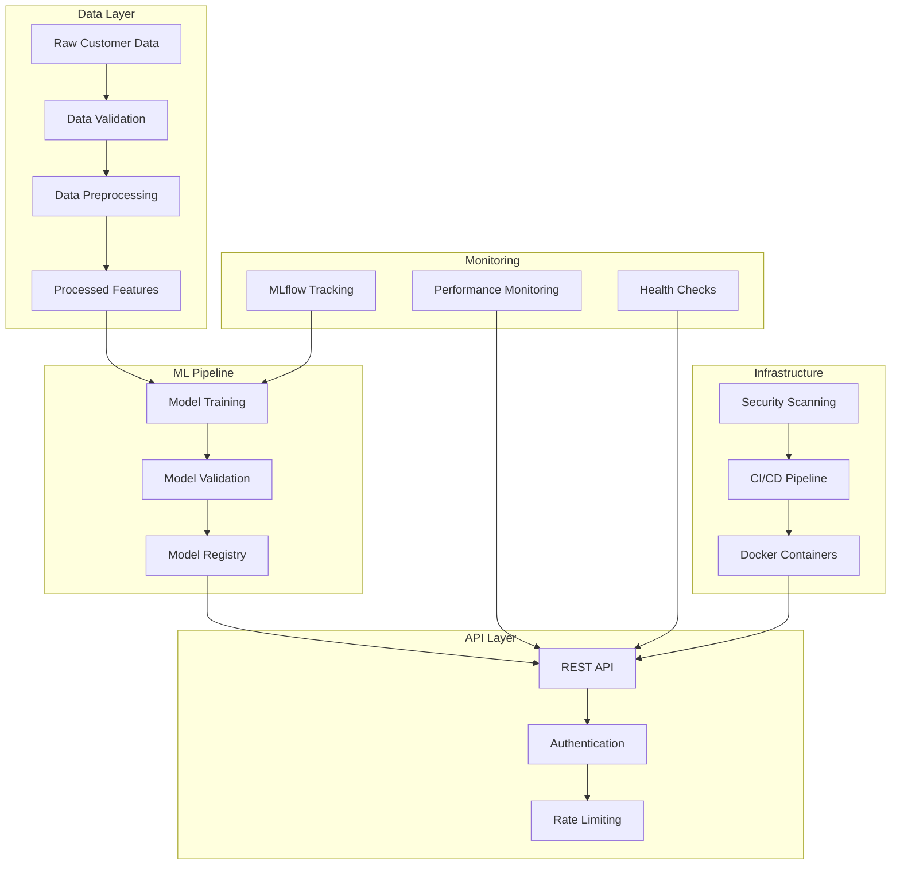

# Architecture Documentation

## System Overview

The Customer Churn Predictor is a production-ready MLOps system designed to predict customer churn using machine learning. The architecture follows cloud-native patterns with containerization, monitoring, and automated CI/CD pipelines.

## High-Level Architecture

## Component Architecture

### Data Processing Pipeline
- **Input**: Raw customer data in CSV format
- **Validation**: Schema validation, data quality checks
- **Preprocessing**: Feature engineering, encoding, scaling
- **Output**: Processed features ready for model training

### Model Training System
- **Framework**: Scikit-learn with logistic regression
- **Tracking**: MLflow for experiment management
- **Versioning**: Model artifacts stored with metadata
- **Validation**: Cross-validation and performance metrics

### API Service
- **Framework**: FastAPI for high-performance REST API
- **Authentication**: Bearer token-based security
- **Rate Limiting**: Configurable request throttling
- **Monitoring**: Health checks and metrics endpoints

### Infrastructure
- **Containerization**: Docker with multi-stage builds
- **Orchestration**: Docker Compose for local development
- **Monitoring**: Prometheus metrics collection
- **Deployment**: Automated via GitHub Actions

## Data Flow

1. **Ingestion**: Raw customer data loaded from CSV files
2. **Validation**: Data quality checks and schema validation
3. **Preprocessing**: Feature engineering and transformation
4. **Training**: Model training with hyperparameter optimization
5. **Evaluation**: Performance metrics and model validation
6. **Deployment**: Model serving via REST API
7. **Monitoring**: Performance tracking and drift detection

## Security Architecture

### Authentication & Authorization
- API key-based authentication
- Constant-time comparison for security
- Environment-based key management
- Audit logging for all access attempts

### Data Security
- Input validation and sanitization
- Secure handling of customer data
- Encryption in transit and at rest
- No sensitive data in logs

### Infrastructure Security
- Container security scanning
- Dependency vulnerability checks
- Secret management best practices
- Network security controls

## Scalability Considerations

### Horizontal Scaling
- Stateless API design
- Container-based deployment
- Load balancer ready
- Database connection pooling

### Performance Optimization
- Model caching strategies
- Async processing capabilities
- Resource monitoring
- Auto-scaling triggers

## Technology Stack

### Core Technologies
- **Python 3.12**: Primary development language
- **Scikit-learn**: Machine learning framework
- **FastAPI**: REST API framework
- **MLflow**: Experiment tracking
- **Docker**: Containerization

### Development Tools
- **pytest**: Testing framework
- **black**: Code formatting
- **flake8**: Linting
- **mypy**: Type checking
- **pre-commit**: Git hooks

### Infrastructure
- **GitHub Actions**: CI/CD pipeline
- **Prometheus**: Metrics collection
- **Grafana**: Monitoring dashboards
- **Docker Compose**: Local orchestration

## Deployment Architecture

### Development Environment
- Local Docker Compose setup
- Hot reloading for development
- Test data and mock services
- Debug logging enabled

### Production Environment
- Container registry deployment
- Health check monitoring
- Centralized logging
- Performance metrics collection

## Quality Assurance

### Testing Strategy
- Unit tests for all components
- Integration tests for API endpoints
- Performance tests for model inference
- Security tests for authentication

### Code Quality
- Automated code formatting
- Static analysis and linting
- Type checking with mypy
- Pre-commit hooks for quality gates

## Monitoring & Observability

### Application Monitoring
- Health check endpoints
- Performance metrics
- Error tracking and alerting
- Request/response logging

### Model Monitoring
- Prediction accuracy tracking
- Data drift detection
- Model performance degradation alerts
- A/B testing capabilities

## Disaster Recovery

### Backup Strategy
- Model artifact versioning
- Configuration backup
- Data backup procedures
- Recovery time objectives

### Rollback Procedures
- Model version rollback
- Configuration rollback
- Database rollback procedures
- Automated rollback triggers