# Contributing to Customer Churn Predictor

## Welcome! 🎉

Thank you for your interest in contributing to the Customer Churn Predictor project! This guide will help you get started with contributing to our production-ready ML system.

## Table of Contents

- [Code of Conduct](#code-of-conduct)
- [Getting Started](#getting-started)
- [How to Contribute](#how-to-contribute)
- [Development Process](#development-process)
- [Code Standards](#code-standards)
- [Testing Guidelines](#testing-guidelines)
- [Documentation Standards](#documentation-standards)
- [Pull Request Process](#pull-request-process)
- [Community](#community)

## Code of Conduct

This project adheres to a [Code of Conduct](CODE_OF_CONDUCT.md). By participating, you are expected to uphold this code. Please report unacceptable behavior to [team@yourorg.com](mailto:team@yourorg.com).

## Getting Started

### Prerequisites

Before you begin, ensure you have:

- **Python 3.12+** installed
- **Git** for version control
- **Docker** for containerized development
- **Make** for build automation (optional)

### Setting Up Your Development Environment

1. **Fork the repository** on GitHub
2. **Clone your fork** locally:
   ```bash
   git clone https://github.com/yourusername/customer-churn-predictor.git
   cd customer-churn-predictor
   ```

3. **Add the upstream repository**:
   ```bash
   git remote add upstream https://github.com/yourorg/customer-churn-predictor.git
   ```

4. **Set up the development environment**:
   ```bash
   make setup
   # Or manually:
   python -m venv venv
   source venv/bin/activate
   pip install -r requirements-dev.txt
   pre-commit install
   ```

5. **Verify your setup**:
   ```bash
   make test
   ```

## How to Contribute

### Types of Contributions

We welcome all types of contributions:

- 🐛 **Bug Reports**: Found a bug? Let us know!
- ✨ **Feature Requests**: Have an idea? We'd love to hear it!
- 📝 **Documentation**: Help improve our docs
- 🧪 **Tests**: Add or improve test coverage
- 🔧 **Code**: Fix bugs or implement features
- 🎨 **Design**: UI/UX improvements
- 📊 **Data Science**: ML model improvements

### Reporting Issues

Before creating an issue, please:

1. **Search existing issues** to avoid duplicates
2. **Use the issue templates** when available
3. **Provide detailed information**:
   - Clear description of the problem
   - Steps to reproduce
   - Expected vs. actual behavior
   - Environment details (OS, Python version, etc.)
   - Screenshots or logs (if applicable)

### Suggesting Features

For feature requests:

1. **Check the roadmap** to see if it's already planned
2. **Discuss in GitHub Discussions** for major features
3. **Use the feature request template**
4. **Provide use cases** and business value
5. **Consider implementation complexity**

## Development Process

### Workflow Overview

```mermaid
flowchart LR
    A[Fork Repository] --> B[Create Feature Branch]
    B --> C[Make Changes]
    C --> D[Add Tests]
    D --> E[Run Quality Checks]
    E --> F[Commit Changes]
    F --> G[Push to Fork]
    G --> H[Create Pull Request]
    H --> I[Code Review]
    I --> J[Address Feedback]
    J --> K[Merge]
```



### Branch Naming Convention

Use descriptive branch names:

- `feature/add-batch-prediction` - New features
- `bugfix/fix-authentication-error` - Bug fixes
- `docs/update-api-documentation` - Documentation updates
- `test/add-performance-tests` - Test improvements
- `refactor/optimize-model-loading` - Code refactoring

### Commit Message Guidelines

Follow [Conventional Commits](https://www.conventionalcommits.org/):

```
<type>[optional scope]: <description>

[optional body]

[optional footer(s)]
```

**Types:**
- `feat`: New feature
- `fix`: Bug fix
- `docs`: Documentation changes
- `test`: Adding or updating tests
- `refactor`: Code refactoring
- `perf`: Performance improvements
- `ci`: CI/CD changes
- `chore`: Maintenance tasks

**Examples:**
```
feat(api): add batch prediction endpoint

Implement batch prediction functionality to process multiple
customer records in a single API call.

Closes #123
```

```
fix(auth): resolve token validation error

Fix issue where API keys shorter than 16 characters were
incorrectly accepted.

Fixes #456
```

## Code Standards

### Python Code Style

We follow strict code quality standards:

- **Formatter**: Black (line length: 88)
- **Import sorting**: isort (black profile)
- **Linting**: Flake8 with security extensions
- **Type checking**: mypy with strict settings
- **Security**: Bandit for security analysis

### Code Quality Checklist

Before submitting code, ensure:

- [ ] Code is formatted with Black
- [ ] Imports are sorted with isort
- [ ] No linting errors from Flake8
- [ ] Type hints added for all functions
- [ ] No security issues from Bandit
- [ ] All tests pass
- [ ] Code coverage ≥ 80%

### Running Code Quality Checks

```bash
# Format code
make format

# Run all quality checks
make lint

# Fix import sorting
isort src/ tests/

# Check types
mypy src/

# Security scan
bandit -r src/
```

## Testing Guidelines

### Test Categories

We maintain comprehensive test coverage:

1. **Unit Tests** (`tests/`) - Test individual functions and classes
2. **Integration Tests** (`tests/integration/`) - Test component interactions
3. **Security Tests** (`tests/security/`) - Test security measures
4. **Performance Tests** (`tests/performance/`) - Test performance requirements

### Writing Tests

- Use **pytest** for all tests
- Follow **AAA pattern** (Arrange, Act, Assert)
- Use **descriptive test names**
- Include **docstrings** for complex tests
- Mock **external dependencies**

```python
def test_predict_churn_returns_valid_prediction():
    """Test that predict_churn returns a valid prediction structure."""
    # Arrange
    predictor = ChurnPredictor(model_path="test_model.joblib")
    features = {"tenure": 12, "monthly_charges": 50.0}
    
    # Act
    result = predictor.predict(features)
    
    # Assert
    assert "prediction" in result
    assert "probability" in result
    assert 0 <= result["probability"] <= 1
```

### Test Coverage Requirements

- **Minimum coverage**: 80% overall
- **Critical paths**: 100% coverage
- **New code**: Must not decrease coverage
- **Edge cases**: Include error scenarios

### Running Tests

```bash
# Run all tests
make test

# Run specific test categories
make test-unit
make test-integration
make test-security
make test-performance

# Run with coverage
make coverage

# Run specific test file
pytest tests/test_api.py -v
```

## Documentation Standards

### Documentation Types

1. **Code Documentation**
   - Docstrings for all public functions/classes
   - Inline comments for complex logic
   - Type hints for all parameters

2. **API Documentation**
   - OpenAPI/Swagger specifications
   - Request/response examples
   - Error code documentation

3. **User Documentation**
   - README updates for new features
   - Usage examples and tutorials
   - Architecture documentation

### Docstring Style

Use Google-style docstrings:

```python
def predict_churn(features: Dict[str, Any]) -> Dict[str, Any]:
    """Predict customer churn probability.
    
    This function uses a trained machine learning model to predict
    the likelihood of customer churn based on provided features.
    
    Args:
        features: Dictionary containing customer features such as
            tenure, monthly charges, and demographic information.
            
    Returns:
        Dictionary containing prediction results with keys:
        - prediction: Binary churn prediction (0 or 1)
        - probability: Churn probability (0.0 to 1.0)
        - confidence: Model confidence in the prediction
        
    Raises:
        ValueError: If required features are missing or invalid.
        ModelNotLoadedError: If the model hasn't been loaded.
        
    Example:
        >>> features = {"tenure": 12, "monthly_charges": 50.0}
        >>> result = predict_churn(features)
        >>> print(result["probability"])
        0.23
    """
```

## Pull Request Process

### Before Creating a PR

1. **Sync with upstream**:
   ```bash
   git fetch upstream
   git checkout main
   git merge upstream/main
   git push origin main
   ```

2. **Rebase your feature branch**:
   ```bash
   git checkout your-feature-branch
   git rebase main
   ```

3. **Run the full test suite**:
   ```bash
   make ci-test
   ```

### PR Template Checklist

When creating a PR, ensure you:

- [ ] **Describe the change** clearly in the PR description
- [ ] **Link related issues** (Closes #123, Fixes #456)
- [ ] **Add/update tests** for new functionality
- [ ] **Update documentation** if needed
- [ ] **Check that CI passes** on all platforms
- [ ] **Request review** from appropriate maintainers
- [ ] **Ensure branch is up to date** with main

### PR Review Process

1. **Automated Checks**: CI must pass
2. **Code Review**: At least one maintainer approval required
3. **Testing**: Verify functionality works as expected
4. **Documentation**: Check docs are updated
5. **Merge**: Squash and merge preferred

### Addressing Review Feedback

- **Be responsive** to review comments
- **Ask questions** if feedback is unclear
- **Make requested changes** promptly
- **Update tests** if implementation changes
- **Notify reviewers** when ready for re-review

## Community

### Communication Channels

- **GitHub Issues**: Bug reports and feature requests
- **GitHub Discussions**: General questions and ideas
- **Slack**: Real-time development discussion
- **Email**: [team@yourorg.com](mailto:team@yourorg.com)

### Getting Help

If you need help:

1. **Check existing documentation** in the `docs/` folder
2. **Search GitHub issues** for similar problems
3. **Ask in GitHub Discussions** for general questions
4. **Create an issue** for bugs or specific problems

### Recognition

Contributors are recognized through:

- **GitHub contributor graphs**
- **Release notes acknowledgments**
- **Hall of Fame** in project documentation
- **Maintainer nominations** for significant contributors

## Advanced Contributing

### Becoming a Maintainer

Regular contributors may be invited to become maintainers. Maintainers have:

- **Commit access** to the repository
- **Review responsibilities** for PRs
- **Release management** duties
- **Community leadership** roles

### ML Model Contributions

For ML-related contributions:

- **Document methodology** changes thoroughly
- **Include performance metrics** comparisons
- **Provide test datasets** when possible
- **Consider ethical implications** of changes
- **Follow reproducibility guidelines**

### Performance Considerations

When contributing code that may affect performance:

- **Run performance tests** before and after changes
- **Profile critical paths** for bottlenecks
- **Consider memory usage** implications
- **Document performance characteristics**

## Release Process

Our release process follows semantic versioning:

- **Major versions** (1.0.0): Breaking changes
- **Minor versions** (1.1.0): New features, backward compatible
- **Patch versions** (1.1.1): Bug fixes, backward compatible

Contributors can help with:

- **Testing release candidates**
- **Updating documentation**
- **Writing release notes**
- **Validating upgrade paths**

## License and Copyright

By contributing to this project, you agree that your contributions will be licensed under the same [Apache 2.0 License](LICENSE) that covers the project.

---

## Thank You! 🙏

Your contributions make this project better for everyone. Whether you're fixing a typo, adding a feature, or improving documentation, every contribution is valued and appreciated.

**Happy contributing!** 🚀