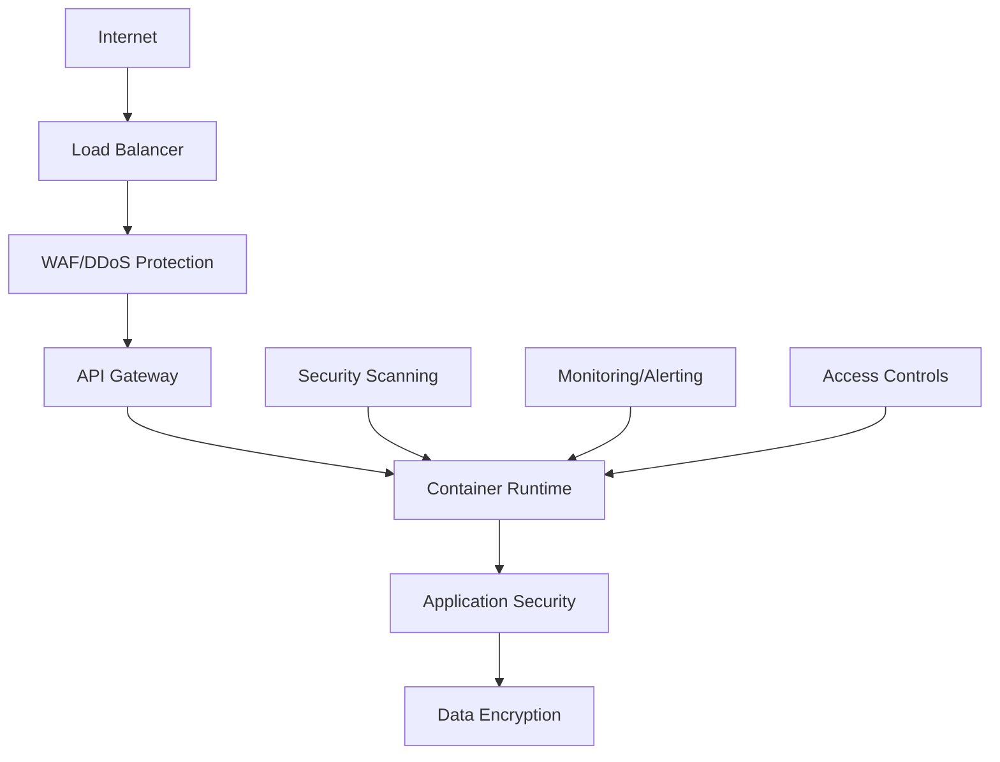

# Security Guide

This document provides comprehensive security guidance for the Customer Churn Prediction application, including container security, vulnerability management, and deployment hardening.

## Security Features

### Container Security Scanning

The application includes comprehensive security scanning capabilities:

- **Vulnerability Assessment**: Uses Trivy for CVE scanning
- **Secret Detection**: Scans for hardcoded secrets and sensitive data
- **Configuration Analysis**: Checks for security misconfigurations
- **Image Signature Verification**: Supports Cosign for image signing

### Built-in Security Commands

```bash
# Scan Docker image for vulnerabilities
python -m src.cli security-scan churn-predictor:latest

# View security policies
python -m src.cli security-policies

# Run automated security scan script
./scripts/security-scan.sh churn-predictor:latest
```

## Security Policies

### Container Runtime Security

| Policy | Status | Enforcement | Description |
|--------|--------|-------------|-------------|
| Non-root User | ✅ Enabled | Required | Containers run as non-root user (UID 1000) |
| Read-only Filesystem | ✅ Enabled | Recommended | Root filesystem is read-only |
| No Privileged Containers | ✅ Enabled | Required | Privileged mode disabled |
| Capability Dropping | ✅ Enabled | Recommended | All Linux capabilities dropped |
| Resource Limits | ✅ Enabled | Required | Memory and CPU limits enforced |

### Network Security

| Policy | Status | Description |
|--------|--------|-------------|
| Network Isolation | ✅ Enabled | Containers use isolated bridge network |
| Port Restrictions | ✅ Enabled | Only necessary ports exposed (8000) |
| Ingress Controls | ✅ Enabled | Whitelist-based ingress traffic |
| Egress Filtering | ⚠️ Recommended | Restrict outbound connections |

### Image Security

| Requirement | Status | Description |
|-------------|--------|-------------|
| Vulnerability Scanning | ✅ Implemented | Trivy-based CVE scanning |
| Base Image Restrictions | ✅ Enforced | No `latest` tags in production |
| Signature Verification | ⚠️ Optional | Cosign-based image signing |
| Registry Restrictions | ✅ Configured | Trusted registries only |

## Security Architecture

### Defense in Depth



### Security Boundaries

1. **Network Perimeter**: WAF, DDoS protection, API gateway
2. **Container Boundary**: Runtime security, resource limits
3. **Application Layer**: Input validation, authentication
4. **Data Layer**: Encryption at rest and in transit

## Vulnerability Management

### Scanning Schedule

- **Pre-deployment**: Every image build
- **Runtime**: Weekly automated scans
- **On-demand**: Manual security assessments

### Severity Thresholds

| Severity | Max Allowed | Action Required |
|----------|-------------|-----------------|
| Critical | 0 | Immediate fix |
| High | 0 | Fix within 7 days |
| Medium | 5 | Fix within 30 days |
| Low | No limit | Monitor and plan |

### Remediation Process

1. **Detection**: Automated scanning identifies vulnerabilities
2. **Assessment**: Security team evaluates impact and exploitability
3. **Prioritization**: Based on CVSS score and business impact
4. **Remediation**: Update packages, rebuild images, redeploy
5. **Verification**: Re-scan to confirm fixes

## Secure Development Practices

### Code Security

- **Static Analysis**: SAST tools integrated in CI/CD
- **Dependency Scanning**: Automated dependency vulnerability checks
- **Secret Management**: No hardcoded secrets, environment variables only
- **Input Validation**: All user inputs validated and sanitized

### Container Security

- **Minimal Base Images**: Use distroless or minimal base images
- **Layer Optimization**: Minimize image layers and attack surface
- **Non-root Execution**: All containers run as non-root user
- **Immutable Images**: Images are read-only and immutable

### CI/CD Security

```yaml
# Example GitHub Actions security workflow
name: Security Scan
on: [push, pull_request]

jobs:
  security:
    runs-on: ubuntu-latest
    steps:
    - uses: actions/checkout@v3
    
    - name: Build Image
      run: docker build -t test-image .
    
    - name: Security Scan
      run: ./scripts/security-scan.sh test-image
    
    - name: Upload Results
      uses: actions/upload-artifact@v3
      with:
        name: security-reports
        path: security-reports/
```

## Runtime Security

### Monitoring and Alerting

- **Container Behavior**: Falco for runtime security monitoring
- **Network Traffic**: Monitor for suspicious network activity
- **Resource Usage**: Alert on unusual resource consumption
- **File System**: Monitor for unauthorized file modifications

### Incident Response

1. **Detection**: Automated alerts for security events
2. **Isolation**: Immediate container isolation if needed
3. **Investigation**: Log analysis and forensic examination
4. **Containment**: Prevent lateral movement
5. **Recovery**: Clean deployment from known-good images

## Compliance and Auditing

### Audit Logging

All security-relevant events are logged:

- Authentication attempts
- Authorization failures
- Configuration changes
- Vulnerability scan results
- Security policy violations

### Compliance Frameworks

The security implementation supports:

- **SOC 2**: Security controls and monitoring
- **ISO 27001**: Information security management
- **NIST**: Cybersecurity framework compliance
- **CIS**: Container security benchmarks

## Security Configuration

### Environment Variables

```bash
# Security scanner configuration
SECURITY_SCAN_ENABLED=true
MAX_HIGH_VULNERABILITIES=0
MAX_MEDIUM_VULNERABILITIES=5
FAIL_ON_VULNERABILITIES=true

# Runtime security
RUN_AS_NON_ROOT=true
READ_ONLY_ROOT_FILESYSTEM=true
DROP_ALL_CAPABILITIES=true

# Network security
ALLOWED_INGRESS_PORTS=8000
ENABLE_NETWORK_POLICIES=true
```

### Kubernetes Security Context

```yaml
apiVersion: v1
kind: Pod
spec:
  securityContext:
    runAsNonRoot: true
    runAsUser: 1000
    runAsGroup: 1000
    fsGroup: 1000
  containers:
  - name: churn-predictor
    securityContext:
      allowPrivilegeEscalation: false
      readOnlyRootFilesystem: true
      capabilities:
        drop: ["ALL"]
      seccompProfile:
        type: RuntimeDefault
    resources:
      limits:
        memory: "1Gi"
        cpu: "1000m"
      requests:
        memory: "512Mi"
        cpu: "500m"
```

## Security Testing

### Automated Testing

- **Unit Tests**: Security function testing
- **Integration Tests**: End-to-end security workflow
- **Vulnerability Tests**: Simulated vulnerability scenarios
- **Policy Tests**: Security policy enforcement validation

### Manual Testing

- **Penetration Testing**: Quarterly external assessments
- **Code Reviews**: Security-focused code reviews
- **Configuration Audits**: Infrastructure security reviews
- **Threat Modeling**: Regular threat assessment updates

## Troubleshooting

### Common Security Issues

1. **High Vulnerability Count**
   - Update base image to latest patched version
   - Remove unnecessary packages
   - Use minimal base images (distroless)

2. **Failed Signature Verification**
   - Ensure Cosign is properly configured
   - Verify signing keys are available
   - Check image was signed correctly

3. **Policy Violations**
   - Review Kubernetes security policies
   - Check container security context
   - Validate resource constraints

### Security Logs

```bash
# View security scan logs
docker logs churn-predictor 2>&1 | grep -i security

# Check vulnerability scan results
cat security-reports/vulnerability-report.json

# Review security policies
python -m src.cli security-policies
```

## Contact and Support

For security issues:

- **Security Team**: security@company.com
- **Incident Response**: incident-response@company.com
- **Vulnerability Disclosure**: security-disclosure@company.com

**Note**: Please report security vulnerabilities privately and allow time for remediation before public disclosure.