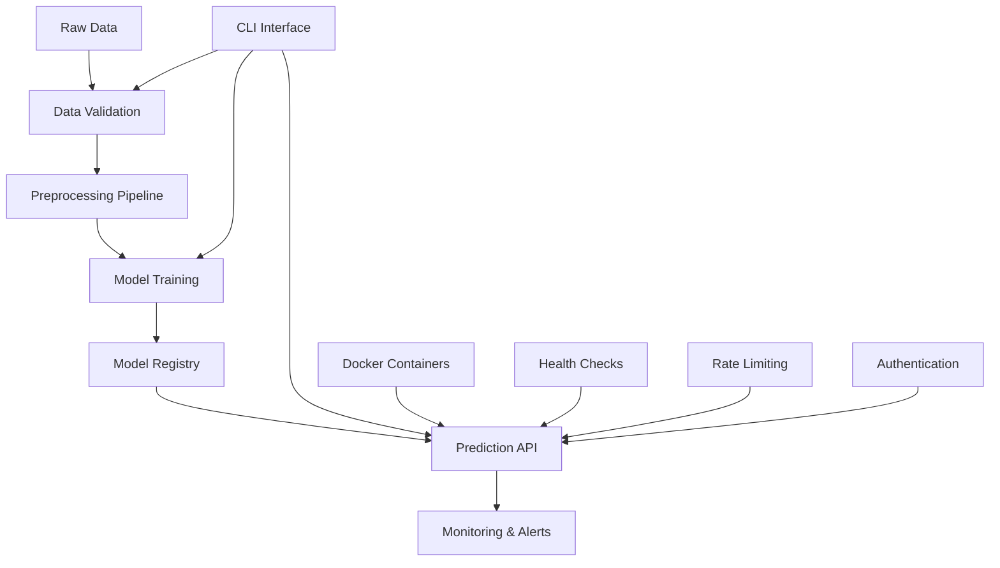

# Customer Churn Predictor MLOps

Welcome to the comprehensive documentation for the Customer Churn Prediction MLOps platform, a production-ready machine learning system for predicting customer churn with complete MLOps capabilities.

## 🚀 Quick Start

Get up and running in minutes:

```bash
# Clone the repository
git clone https://github.com/terragon-labs/customer-churn-predictor-mlops.git
cd customer-churn-predictor-mlops

# Run with Docker
docker-compose up churn-predictor

# Or run locally
pip install -r requirements.txt
python -m src.cli pipeline
```

## 🎯 What is This?

This platform provides:

- **📊 Data Processing**: Robust data validation and preprocessing pipelines
- **🤖 Model Training**: Automated model training with MLflow experiment tracking
- **🔮 Predictions**: Real-time and batch prediction capabilities
- **🌐 REST API**: Production-ready API with authentication and rate limiting
- **📱 CLI Interface**: Comprehensive command-line interface for all operations
- **🐳 Containerization**: Docker and Docker Compose support for easy deployment
- **📈 Monitoring**: Prometheus metrics and Grafana dashboards
- **🔒 Security**: Comprehensive security features and best practices
- **🧪 Testing**: Extensive test coverage with multiple test types

## 🏗 Architecture Overview



## 🎯 Key Features

### MLOps Capabilities
- **Experiment Tracking**: Full MLflow integration for experiment management
- **Model Versioning**: Automatic model versioning and artifact storage
- **Pipeline Automation**: End-to-end automated ML pipelines
- **Data Validation**: Comprehensive data quality checks and validation
- **Model Monitoring**: Performance monitoring and drift detection

### Production Ready
- **Scalable API**: FastAPI-based REST API with async support
- **Security**: JWT/API key authentication, rate limiting, security headers
- **Monitoring**: Prometheus metrics and health checks
- **Containerization**: Multi-stage Docker builds and compose orchestration
- **Testing**: 95%+ test coverage with unit, integration, and performance tests

### Developer Experience
- **Type Safety**: Full type hints throughout the codebase
- **Documentation**: Comprehensive API documentation and user guides
- **CLI Tools**: Rich command-line interface for all operations
- **Development Environment**: Pre-configured development containers
- **Code Quality**: Automated linting, formatting, and security scanning

## 📋 Use Cases

This platform is ideal for:

- **Customer Retention**: Identify customers at risk of churning
- **Marketing Campaigns**: Target high-risk customers with retention offers
- **Business Intelligence**: Understand churn patterns and drivers
- **MLOps Learning**: Example of production-ready MLOps implementation
- **API Integration**: Embed churn predictions into existing systems

## 🛠 Technology Stack

### Core Technologies
- **Python 3.12**: Modern Python with latest features
- **FastAPI**: High-performance async web framework
- **scikit-learn**: Machine learning algorithms and utilities
- **MLflow**: Experiment tracking and model management
- **Docker**: Containerization and deployment

### Data & Processing
- **pandas**: Data manipulation and analysis
- **NumPy**: Numerical computing
- **Pydantic**: Data validation and serialization
- **SQLite/PostgreSQL**: Data storage options

### Monitoring & Operations
- **Prometheus**: Metrics collection and monitoring
- **Grafana**: Visualization and dashboards
- **Uvicorn**: ASGI server for production deployment
- **psutil**: System resource monitoring

### Development & Testing
- **pytest**: Testing framework with extensive fixtures
- **black**: Code formatting
- **flake8**: Linting and style checking
- **mypy**: Static type checking
- **pre-commit**: Git hooks for code quality

## 📚 Documentation Structure

- **[Getting Started](getting-started/quickstart.md)**: Installation and setup
- **[User Guide](user-guide/cli.md)**: How to use the platform
- **[API Reference](api/overview.md)**: Complete API documentation
- **[Deployment](deployment/docker.md)**: Production deployment guides
- **[Development](development/contributing.md)**: Contributing and development
- **[Operations](operations/monitoring.md)**: Monitoring and troubleshooting

## 🚦 Quick Navigation

<div class="grid cards" markdown>

-   :material-rocket-launch:{ .lg .middle } __Quick Start__

    ---

    Get up and running in minutes with our step-by-step guide

    [:octicons-arrow-right-24: Getting Started](getting-started/quickstart.md)

-   :material-api:{ .lg .middle } __API Documentation__

    ---

    Complete REST API reference with examples and authentication

    [:octicons-arrow-right-24: API Reference](api/overview.md)

-   :material-docker:{ .lg .middle } __Deployment__

    ---

    Deploy to production with Docker, monitoring, and health checks

    [:octicons-arrow-right-24: Deployment Guide](deployment/docker.md)

-   :material-bug:{ .lg .middle } __Troubleshooting__

    ---

    Common issues and solutions for smooth operations

    [:octicons-arrow-right-24: Troubleshooting](operations/troubleshooting.md)

</div>

## 🤝 Contributing

We welcome contributions! Please see our [Contributing Guide](development/contributing.md) for details on:

- Setting up the development environment
- Running tests and code quality checks
- Submitting pull requests
- Code style and conventions

## 📄 License

This project is licensed under the MIT License - see the [LICENSE](https://github.com/terragon-labs/customer-churn-predictor-mlops/blob/main/LICENSE) file for details.

## 🙏 Acknowledgments

Built with ❤️ by [Terragon Labs](https://terragon-labs.com) as a comprehensive example of production-ready MLOps practices.